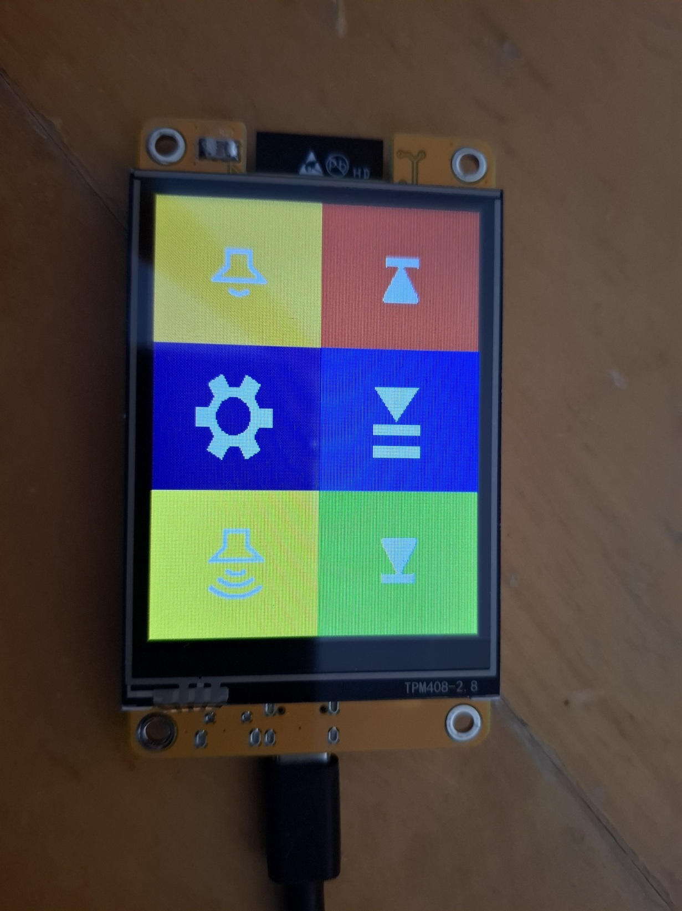

# CYD StreamDeck

呢個係一個基於 **ESP32-Cheap-Yellow-Display** 嘅 **StreamDeck 控制器**，可以通過藍牙控制電腦嘅媒體播放同音量。佢好適合需要快速控制媒體播放嘅場景。

## 🌐 語言選項

- [English](README.md)
- [繁體中文](README_TC.md)
- [简体中文](README_CN.md)
- [粵語](README_CANTON.md)
- [Bahasa Melayu](README_MS.md)

---

## 🌟 核心功能

### 📟 1. 顯示介面

📌 **主頁面：**
- **播放控制**：上一首、播放/暫停、下一首
- **音量控制**：音量增加、音量減少
- **設定按鈕**：進入設定頁面

📌 **設定頁面：**
- **亮度調節**：可以調整螢幕亮度
- **藍牙配對**：配對/取消配對按鈕
- **連接狀態**：顯示當前藍牙連接狀態

---

## 📡 2. 硬件規格

- **顯示器**：320x240 TFT 觸控螢幕
- **觸控**：XPT2046 觸控晶片
- **通訊**：ESP32 藍牙鍵盤功能
- **按鈕**：6 個虛擬按鈕，支援觸控反饋

---

## 🔔 3. 媒體控制功能

- **播放控制**：
  - 播放/暫停
  - 上一首
  - 下一首
- **音量控制**：
  - 音量增加
  - 音量減少

---

## ⚙ 4. 自動化功能

- **自動亮度記憶**：記住上次設定嘅亮度
- **自動重連**：藍牙斷開時自動嘗試重連
- **觸控反饋**：按鈕點擊時有視覺反饋

---

## 🚨 5. 錯誤處理

- **藍牙連接監控**：斷開時顯示 "Disconnected"
- **觸控防抖**：防止誤觸同重複觸發

---

## ⚙ 配置說明 (PlatformIO)

呢個專案用 **PlatformIO** 構建，支援多種硬件配置。你可以根據螢幕類型選擇唔同嘅環境（`env`）進行編譯：

- **cyd**：適用於 ILI9341 螢幕（得 microUSB 接口）
- **cyd2usb**：適用於 ST7789 螢幕（有 USB-C 同 microUSB 接口），支援 RGB 反轉同 BGR 色彩順序調整

另外，`platformio.ini` 配置文件包含以下可以自定義嘅選項：
- 螢幕亮度
- TODO: 觸控靈敏度
- TODO: 按鈕佈局

---

## 📝 使用說明

1. 編譯並上傳程式到 ESP32
2. 首次使用時，進入設定頁面進行藍牙配對
3. 配對成功後，就可以用所有媒體控制功能
4. 可以隨時調整亮度或者重新配對

---

## 🔧 開發者說明

- 用 Arduino 框架開發
- 主要依賴庫：
  - TFT_eSPI：螢幕驅動
  - XPT2046_Touchscreen：觸控驅動
  - ESP32 BLE Keyboard：藍牙鍵盤功能 